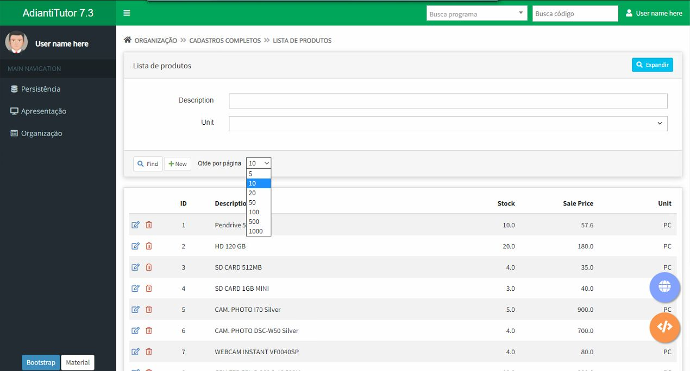
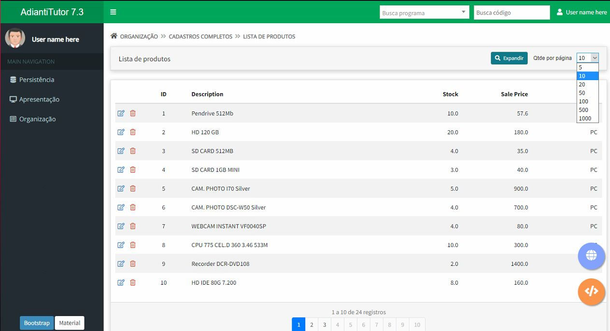

# **LIMITE dinâmico para TDatagrid no Adianti Framework**
> Dynamic LIMIT for TDatagrid in the Adianti Framework




O que é isso? Simples! Este é um seletor que permitirá aos usuários finais escolherem o número de linhas por página mostrada em uma classe TDatagrid.
>What is it? Simple! This is a selector that allows end users to choose the number of lines per page shown in a TDatagrid class.

Um cookie é usado para salvar a escolha do usuário..
>.A cookie is used to save the user's choice.

## **Instalação**
>Installation

### Composer:
```sh
composer require carlosleonam/tdatagrid_dynamic_limit
```

### Incluir no __libraries.html__ ou __libraries_user.html__:
```html
<!-- js-cookie CDN Files -->
<script src="https://cdnjs.cloudflare.com/ajax/libs/jquery-cookie/1.4.1/jquery.cookie.min.js"></script>
```

## **Uso**
>Use

Incluir o "use" no cabeçalho da classe
```php
<?php
use CarlosLeonam\TDatagridDynamicLimit\AdditionalFunctions;
```

No final da **"construct"** da classe, antes da linha **"parent::add($container);"**:
```php
$class_counter = __CLASS__ ;
include('vendor/carlosleonam/tdatagrid_dynamic_limit/src/include_counter.php');
$limit = CarlosLeonam\TDatagridDynamicLimit\AdditionalFunctions::checkCookieForLimit('profile_limit_'. self::$formName .'_per_page');
$this->limit = $limit;
```

Por padrão, o limitador é adicionado a primeira chamada da classe  ".panel-footer:first". Caso deseje mudar esse comportamento, acrescente a seguinte, antes do __"include()"__ acima, alterando o seletor padrão. Ficando assim:
```php
$append_selector = '.panel-footer:first';
$class_counter = __CLASS__ ;
include('vendor/carlosleonam/tdatagrid_dynamic_limit/src/include_counter.php');
```
Mudando para:
```php
$class_counter = __CLASS__ ;
$append_selector = '.header-actions:first';
include('vendor/carlosleonam/tdatagrid_dynamic_limit/src/include_counter.php');
```



